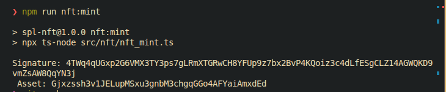
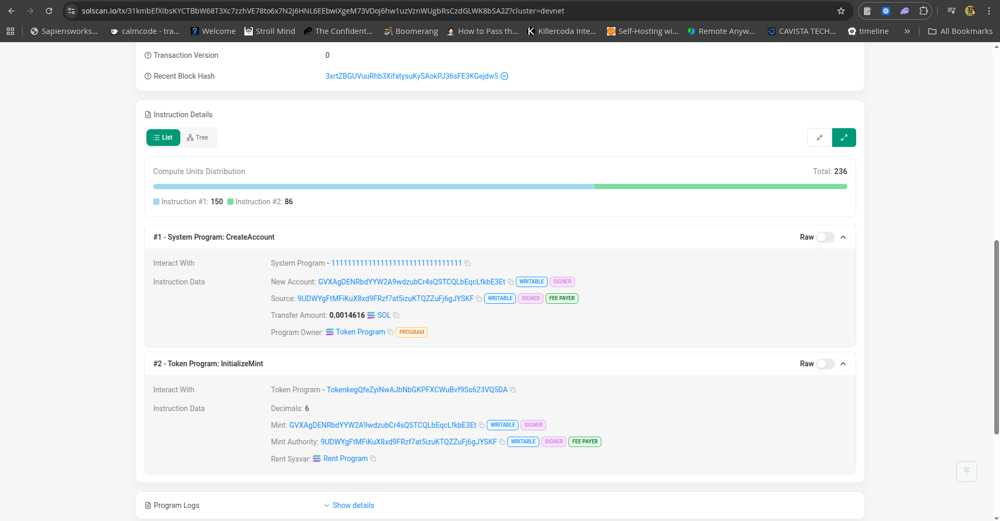
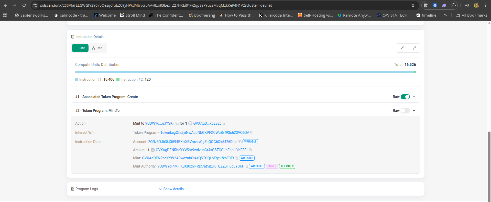
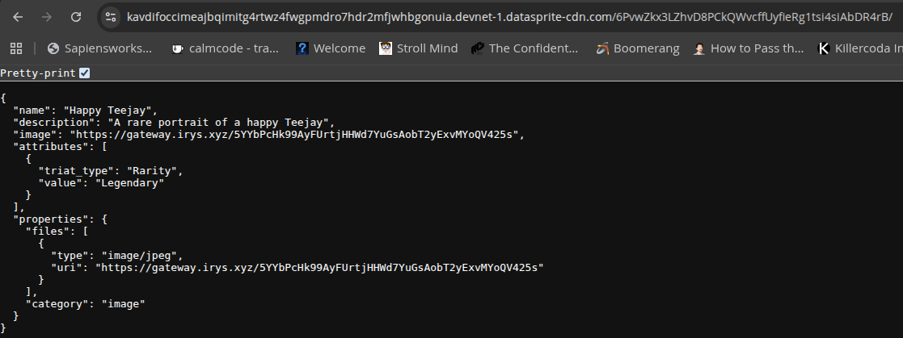
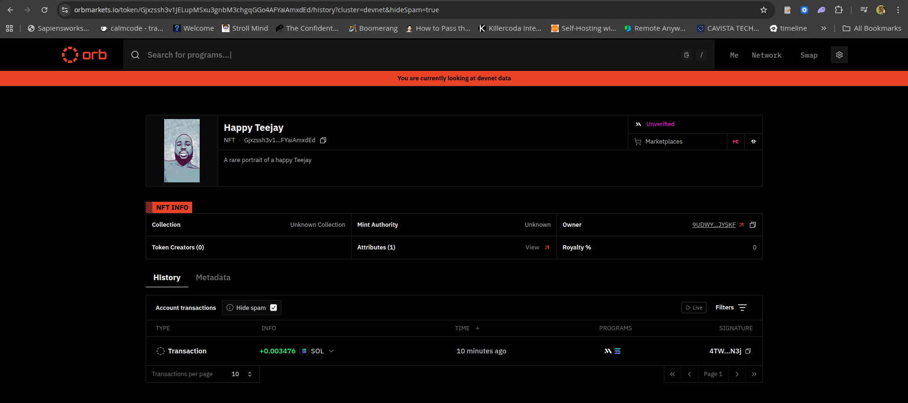

# SPL Token & NFT Minting Project

This project demonstrates an end-to-end workflow for creating and managing SPL tokens and NFTs on Solana using modern tooling. It covers mint initialization, metadata handling, token distribution, NFT asset uploads, and NFT minting using MPL Core. It is designed to be a clear reference for anyone evaluating Solana development capability, architectural thinking, or technical depth.

---

## Overview

### SPL Token

* Initialize a new SPL token mint
* Configure mint authorities and metadata
* Mint an initial supply of tokens
* Transfer tokens between accounts
* Log addresses and signatures for auditability

### NFT (MPL Core)

* Upload NFT image assets using Irys
* Generate and upload metadata JSON
* Use an MPL Core plugin (as required by assignment)
* Mint a uniquely identified NFT
* Log mint address, URIs, and signatures

---

## Tech Stack

* **TypeScript**
* **Solana UMI**
* **Solana Kit**
* **Irys (Bundlr)**
* **Metaplex MPL Core**

---

## Repository Structure

```
src/
 ├── spl/        # Scripts for SPL token lifecycle
 └── nft/        # Scripts for NFT asset upload and minting
package.json
README.md
```

---

## Features Implemented

### SPL Token

1. **Mint Initialization**

   * Generates a new SPL mint
   * Sets decimals and authorities

2. **Metadata Creation**

   * Uploads token metadata
   * Associates metadata URI with mint

3. **Token Supply Minting**

   * Mints specified token amount to the user's associated token account

4. **Token Transfer**

   * Transfers a chosen amount between two wallets

5. **Logging**

   * Outputs mint address, metadata URI, ATAs, and transaction signatures

### NFT (MPL Core)

1. **Image Upload**

   * Uploads image files using Irys

2. **Metadata Upload**

   * Generates metadata JSON
   * Uploads metadata to Irys and returns URI

3. **NFT Minting**

   * Mints an NFT using MPL Core
   * Applies at least one required plugin

4. **Logging**

   * Outputs NFT mint address, URIs, signatures

---

## Setup & Usage

### Installation

```bash
npm install
```

### Environment Variables

Create a `.env` file:

```
RPC_URL=...
RPC_SUB_URL=...
IRYS_UPLOAD_URL=...
```

Ensure the wallet has DEVNET SOL for transactions.

---

## Available Commands

(Adjust names if different in your repo.)

```bash
npm run spl:init        # Create SPL mint + metadata
npm run spl:mint        # Mint token supply
npm run spl:transfer    # Transfer tokens

npm run nft:image       # Upload NFT image
npm run nft:metadata    # Upload NFT metadata
npm run nft:mint        # Mint NFT using MPL Core
```

---

## Sample Outputs



### SPL Token

**Mint Address**
**Metadata URI**
**Associated Token Account**
**Transaction Signature**




---

### NFT

**Image Upload URI**
**Metadata JSON URI**
**NFT Mint Address**
**Transaction Signature**




---

## Assignment Requirements

This project fulfills the following tasks:

* Mint your own SPL token
* Mint an NFT using MPL Core
* Use one MPL Core plugin

Implementation emphasizes clarity, correctness, and maintainability.

---

## Design Considerations

* UMI reduces serialization boilerplate and ensures deterministic transaction flows
* Irys provides permanent storage for NFT image + metadata
* Directory structure isolates SPL vs. NFT concerns
* Logging provides review-friendly traceability
* Scripts are modular and can be composed into a future CLI

---

## Future Enhancements

* Unified CLI for the entire minting workflow
* Multiple token mint support with configuration options
* Integration tests using a local Solana validator
* Web UI to drive token/NFT creation interactively
